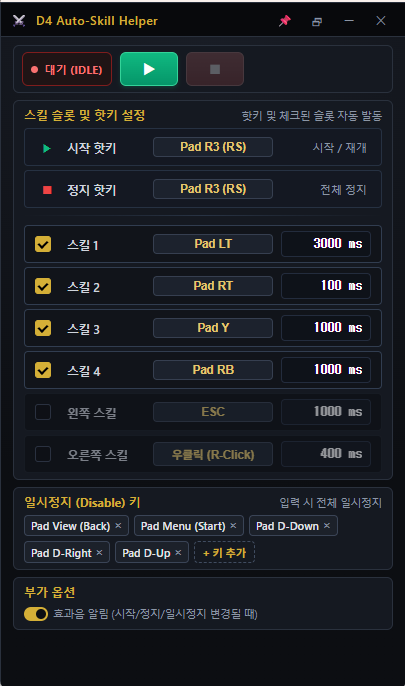
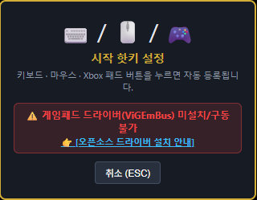

# ⚔️ 디아블로4 자동 스킬 헬퍼 (D4 Auto-Skill Helper)

> **"디아블로4를 게임패드로 재밌게 즐기는데, 편하게 쓸만한 패드 전용 스킬 헬퍼가 없어서 답답한 마음에 직접 만들어 쓰려고 시작했습니다!"** 🎮✨

---

## 1. 💡 앱 개요

디아블로4를 플레이하다 보면 반복해서 눌러야 하는 함성, 방어기, 변신 스킬 때문에 손가락이 피로해질 때가 많죠! 

**디아블로4 자동 스킬 헬퍼**는 키보드와 마우스는 물론, **Xbox 패드 버튼**까지 지원하여 내가 원하는 스킬을 정해진 주기(ms)마다 알아서 똑똑하게 발동시켜 주는 **초경량 자동 스킬 도우미 앱**입니다.

> 📌 **3줄 요약!**
> 1. 키보드 / 마우스 / **Xbox 게임패드** 버튼으로 원하는 스킬을 자유롭게 핫키 지정!
> 2. 스킬 발동 주기(100ms, 1000ms 등)를 내 맘대로 클릭해서 손쉽게 수정!
> 3. 게임 화면을 가리지 않는 **슬림 Mini HUD 모드**와 편리한 일시정지 키 지원!

---

## 2. 🛡️ 안심하고 사용하세요! Human-Like 안전 시스템

많은 유저분들이 자동 헬퍼 사용 시 가장 우려하시는 부분은 **"계정이 안전할까?"** 하는 불안감일 것입니다. 본 앱은 유저분들의 안심을 최우선으로 고려하여 제작되었습니다!

### 🎲 1) 사람 손맛 그대로! 미세 무작위 지연 (Human-Like Random Delay)
- 기계처럼 정확히 `1000.00ms`마다 딱딱하게 누르는 정형화된 매크로는 보안 시스템에 쉽게 탐지될 위험이 있습니다.
- 본 헬퍼는 스킬 발동 시마다 사람이 실제로 손가락으로 누르는 듯한 **미세한 무작위 오차(Human-Like Jittering)**를 미세하게 적용하여 자연스러운 입력 패턴을 형성하므로 안심하고 사용하실 수 있습니다.

### 🔒 2) 게임 메모리 변조 ZERO (Zero Memory Tampering)
- 디아블로4 게임 메모리나 실행 프로세스 내부를 절대로 건드리지 않습니다!
- 메모리 훅(Hook)이나 프로세스 주입(Injection) 방식이 0%이므로, 보안 프로그램이나 밴 시스템에 제재될 리스크가 없는 **100% 안전한 오프스크린 입력 신호 방식**입니다.

### 🎮 3) 윈도우 정식 가상 게임패드 (ViGEmBus) 커널 입력
- Windows 커널 레벨의 정식 가상 컨트롤러(ViGEmBus) 신호를 전달합니다.
- 게임 입장에서는 실제 엑스박스(Xbox) 물리 게임패드를 손으로 누르는 신호와 완전히 동일하게 인식합니다.

---

## 3. 🚀 주요 기능 및 사용법

### 1) ⚡ 내 취향대로 정밀한 스킬 주기 설정
- 6개의 스킬 슬롯마다 원하는 발동 주기(ms)를 숫자로 간편하게 수정할 수 있습니다. (예: 1000ms = 1초마다 발동)
- 각 슬롯의 체크박스를 켜고 끄는 것만으로도 필요한 스킬만 골라서 자동 발동할 수 있어요.
- **시작 / 정지 / 일시정지(Disable)** 핫키를 자유롭게 설정하여 전투 상황에 맞게 제어하세요!

---

### 2) 🖥️ 게임 화면에 착 붙는 슬림 Mini HUD 모드
디아4를 플레이할 때 큰 창이 화면을 가리면 답답하셨죠?
우측 상단 🗗 버튼을 누르면 디아블로4 스킬바 바로 아래에 착 붙는 **극슬림 Mini HUD 모드**로 변신합니다!

- 게임 스킬바 아래에 배치해 두고 한눈에 작동 상태(대기/실행중/일시정지)를 확인할 수 있습니다.
- Mini HUD 모드에서도 `▶ (시작)` 및 `⏹ (정지)` 버튼을 바로 조작할 수 있어 정말 편리합니다!

---

### 3) 🎮 게임패드 사용을 위한 드라이버 안내 (ViGEmBus)
앱에서 Xbox 패드 버튼을 핫키로 등록하거나 가상 패드 신호를 게임에 전달하려면 **ViGEmBus 오픈소스 드라이버** 설치가 최초 1회 필요합니다.

- **🛡️ 오픈소스 투명성 고지**:
  - **드라이버명**: Nefarius ViGEmBus Driver (v1.22.0)
  - **개발자**: Benjamin Hóbor (Nefarius Software)
  - **공식 GitHub**: [github.com/nefarius/ViGEmBus](https://github.com/nefarius/ViGEmBus)
  - **안전성**: 전 세계 수백만 명의 게이머와 가상 패드 프로그램(DS4Windows 등)이 사용하는 **검증된 오픈소스 드라이버(MIT License)**로, 악성코드나 개인정보 수집 걱정 없이 안심하고 사용하셔도 됩니다!

- **👉 1초 만에 끝나는 설치 방법**:
  1. 앱 실행 후 핫키 설정 창이나 안내 팝업에서 **[오픈소스 드라이버 설치 안내]**를 클릭합니다.
  2. 모달 창에서 **[드라이버 승인 설치]** 버튼을 누릅니다.
  3. Windows 관리자 권한 승인 창([예])이 뜨면 눌러주세요. 백그라운드에서 1초 만에 깔끔하게 무음 설치가 완료됩니다!

---

## 4. 💡 스마트한 꿀팁 & 안내

### 🔒 1) 실수 방지! 스마트 핫키 차단 시스템
- **`ESC` 키**나 **`마우스 좌클릭`**을 실수로 핫키에 바인딩하면 앱 조작이 안 되거나 모달 창을 못 닫는 불상사가 생길 수 있죠!
- 본 앱에서는 `ESC` 키와 `마우스 좌클릭`을 핫키로 등록하려 할 경우 **자동으로 차단하고 취소/무시**해 주는 스마트 안전장치가 적용되어 있어 안심하고 키를 등록하실 수 있습니다.

---

### 📦 2) 다운로드 및 실행 방법
1. 상단 **[Releases]** 탭으로 이동합니다.
2. 최신 버전의 `happyhelper-win-x64.zip` 파일의 압축을 풉니다.
3. 따로 복잡한 설치 과정 없이 `happyhelper.exe`를 바로 실행하시면 됩니다!

---

## ❓ 자주 묻는 질문 (FAQ)

- **Q: 백그라운드나 게임 중에도 핫키가 잘 먹히나요?**
  - **A**: 네! 윈도우 전역 핫키 및 저프로필 입력 훅(Global Hook)이 적용되어 있어 디아블로4 게임 실행 중에도 지정한 패드 버튼이나 키보드 핫키로 바로 시작/정지/일시정지가 가능합니다.

- **Q: 게임패드 버튼을 핫키로 지정하고 싶어요!**
  - **A**: 원하는 스킬 옆의 [키 설정] 버튼을 누른 뒤, 손에 쥐고 계신 Xbox 패드의 버튼(`LT`, `RT`, `Y`, `RB`, `R3` 등)을 꾹 누르시면 자동으로 인식되어 바인딩됩니다!

---

즐거운 성역 탐험 되시길 바랍니다! ⚔️🔥  
불편한 점이나 피드백이 있으시다면 언제든 Issues나 문의 남겨주세요!
